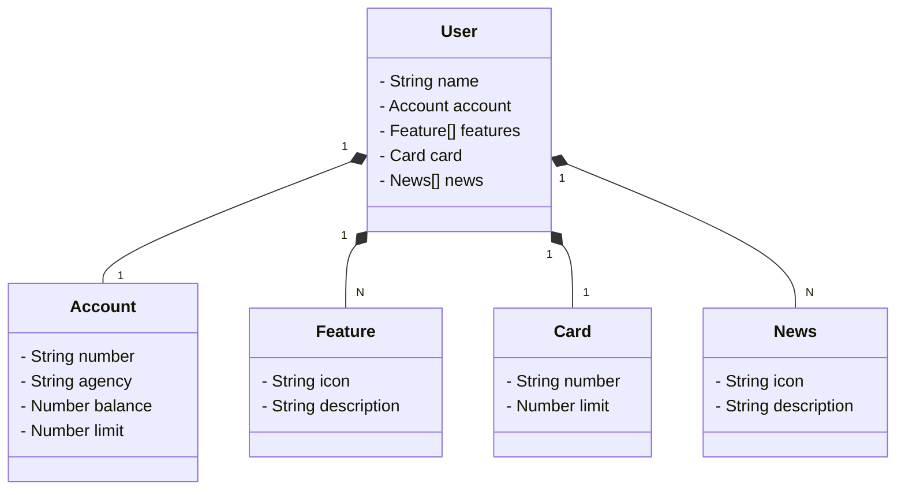

# Santander-Bootcamp-Fullstack-2023-dio
Java RESTful API criada no Santander Bootcamp FullStack 2023 no curso oferecido pela Digital Innovation One.

## Diagrama de classes

```mermaid

classDiagram
  class User {
    - String name
    - Account account
    - Feature[] features
    - Card card
    - News[] news
  }

  class Account {
    - String number
    - String agency
    - Number balance
    - Number limit
  }

  class Feature {
    - String icon
    - String description
  }

  class Card {
    - String number
    - Number limit
  }

  class News {
    - String icon
    - String description
  }

  User "1" *-- "1" Account
  User "1" *-- "N" Feature
  User "1" *-- "1" Card
  User "1" *-- "N" News

```

